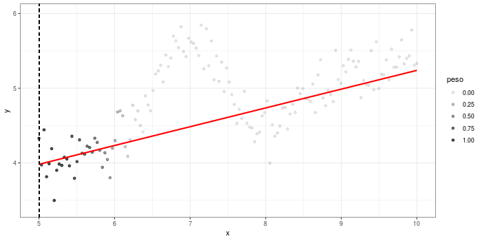

# shinyloess

### About the app

With this Shiny App you can change the values of the parameters needed in a local polynomial regression (LOESS) to visualize their effects in the fitted curve. Sample data is available but you can also upload your own data from a text file.

### How to run the app

Visit [https://mpru.shinyapps.io/shinyloess/](https://mpru.shinyapps.io/shinyloess/) to run it online or follow these steps to use it on your computer:

In your local R installation, make sure you have the packages *shiny*, *ggplot2* and *dplyr*. Then run:

```r
shiny::runGitHub("shinyloess", "mpru") 
```

### Animation: fitting a loess curve

<p align="center">
  
</p>

<p align="center">
  
</p>

App created by Marcos Prunello for the workshop: "Exploratory Data Analysis", taught by Professor Gonzalo Mari at Universidad Nacional de Rosario.
